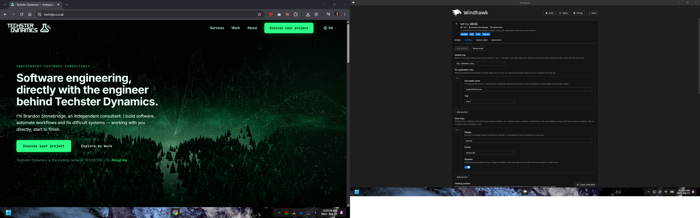
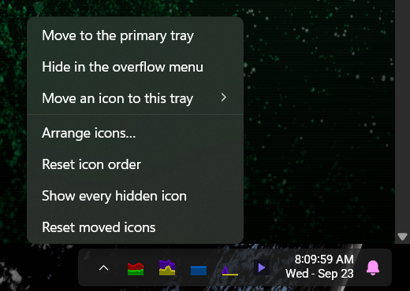
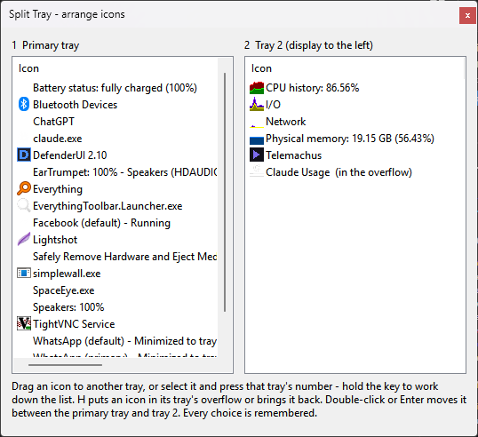
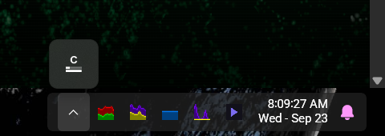
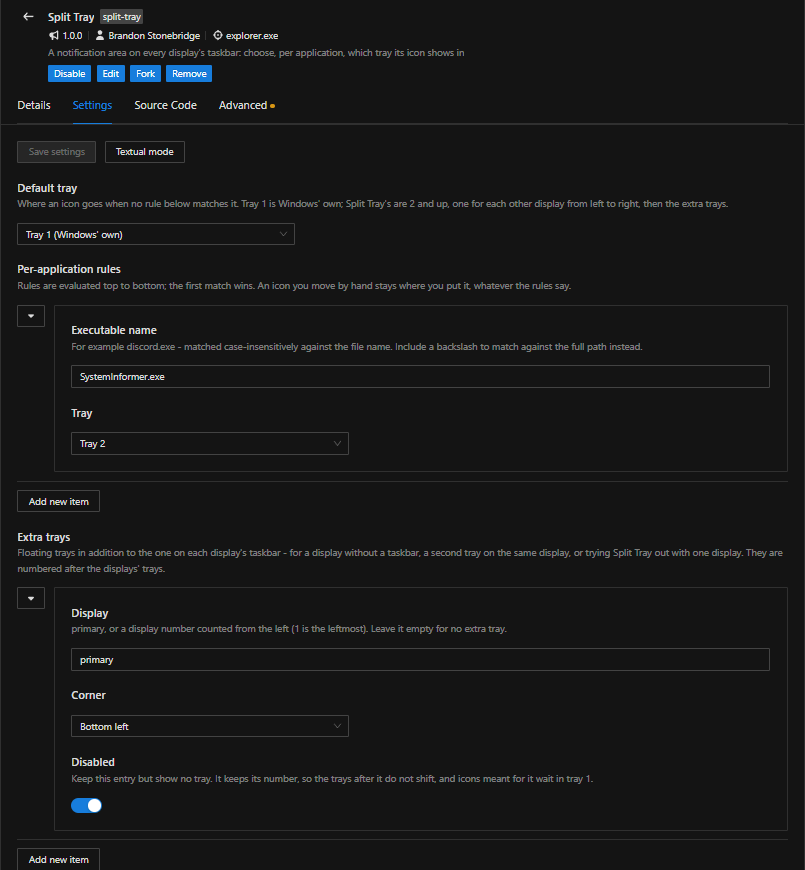

# Split Tray

A [Windhawk](https://windhawk.net) mod that gives every display its own
notification area.

Windows 11 shows the system tray on the main display only. Split Tray puts one
on the taskbar of every other display, beside the clock where the native one
would be, and lets you choose which tray each application's icon lives in.

* A tray inside each extra display's taskbar. Its icons behave like the real
  ones: left, right, double and middle clicks, context menus, tooltips.
* Rules per application, such as "Discord goes to tray 3", and a default tray
  for everything else.
* Move any icon by hand, and it stays where you put it.
* An overflow chevron for the icons you would rather not see all the time.
* Unplug a display and its icons go back to the main tray. Plug it back in and
  they return. With more than one of Split Tray's trays, see
  [Known limits](#known-limits).
* Extra floating trays anywhere you like, for a display without a taskbar or
  for trying the mod out with one display.

An icon sent to another tray is really gone from the main one. Split Tray sits
on the message an application sends to the tray, not on the drawing, so this is
not an overlay or a copy.

## Requirements

* Windows 11. Developed and tested on 24H2 and 25H2 (builds 26100 and 26200).
* [Windhawk](https://windhawk.net) 1.6 or later. Tested with 1.7.3.

## Installing

In Windhawk, choose **Create a new mod**, replace the template with the
contents of [`src/split-tray.wh.cpp`](src/split-tray.wh.cpp), and press
**Compile Mod**. Then enable it. The trays appear once Explorer's taskbar has
started, and applications that were already running re-register their icons
on their own.

To build and install from the command line instead, see
[docs/development.md](docs/development.md).

## Using it

### Tray numbers

**Tray 1** is Windows' own tray on the main display. Split Tray's trays are
**2 and up**: one for each other display, counted from the left, then any extra
trays in the order they are listed in the settings. The rules, the menus and
the arrange window all use these numbers.

With two displays there is one extra tray, tray 2, on the second display.

### Moving icons

* **Shift+right-click** an icon in one of Split Tray's trays to open the Split
  Tray menu. From there you can send the icon to any other tray, hide it behind
  the chevron, or pull icons into this tray from elsewhere. Plain right-click
  still belongs to the application.
* **Shift+left-click** an icon to send it straight back to the main tray.
* **Arrange icons…** (in the menu) opens a window with one list per tray. Drag
  an icon between the lists, or select one and press the number of the tray it
  should go to. **H** hides it behind its tray's chevron or brings it back.

  
  

Every move is remembered, including across restarts, and it outranks the rules.
**Reset moved icons** in the menu hands every icon back to the rules.

An icon you hide waits behind its tray's chevron, the way Windows' own tray
keeps its hidden icons:

An empty tray shows a small handle. Click it for the menu.

### Settings

Set in Windhawk's settings tab for the mod.

| Setting | Default | What it does |
| --- | --- | --- |
| Default tray | Tray 1 | Where an icon goes when no rule matches it. |
| Per-application rules | none | Executable name (or a path fragment, if it contains a `\`) and the tray its icon goes to. First match wins. |
| Extra trays | none | Floating trays on any display: `primary`, or a display number counted from the left, and a corner. **Disabled** hides a tray but keeps its entry and its number. |
| Icons before the overflow chevron | 8 | How many icons a tray in a taskbar shows before the rest go behind the chevron. 0 shows all. |
| Embed in each display's taskbar | on | Off draws every tray as a floating panel instead. |
| Floating position, offsets, icon and cell size, colour, opacity, keep on top | | How floating trays look. |
| Show icons the application marked as hidden | on | Off respects `NIS_HIDDEN` in Split Tray's trays too. |
| Collect existing icons on load | on | Asks running applications to re-register their icons when the mod loads. |

A destination of "Both tray 1 and tray 2" keeps an icon in the main tray and
shows it in tray 2 as well.

## Known limits

* Icons that already existed when the mod loaded are collected by asking
  applications to re-register, with the same `TaskbarCreated` broadcast Explorer
  sends after a restart. A few applications ignore it. Their icons appear the
  next time they update.
* Balloon notifications work only for icons in the main tray, because Windows
  shows them only for icons it has. An icon that lives only in one of Split
  Tray's trays loses them. For an application whose notifications matter, use
  "Both tray 1 and tray 2" rather than tray 2 alone.
* Screen readers cannot reach Split Tray's trays yet.
* Trays are numbered by where the displays are. Unplugging a display renumbers
  every tray after it, the other displays' and the extra trays alike, until it
  is back. An icon shows in whichever tray has its number now, and waits in
  the main tray if no tray does.
* Icons cannot be dragged around on the taskbar itself yet: pointer capture
  inside Explorer's XAML does not hold for a drag. Moving happens in the menu
  and the arrange window instead.
* Embedding relies on symbols in Explorer's own DLLs. A Windows update that
  moves them turns the trays into floating panels until the mod is updated.
  Turning embedding off does the same on purpose.

## How it works

An application shows a tray icon by calling `Shell_NotifyIcon`. That call does
not reach the shell through an API. It packs the icon into a `WM_COPYDATA`
message and sends it to Explorer's `Shell_TrayWnd` window. Split Tray
subclasses that window inside Explorer, so it sees every icon added, changed
or removed by every process. For each icon it then:

* passes the message on to the real tray,
* keeps it for one of its own trays, or
* does both.

The rest follows from that:

* Clicks go back to the owning application over the tray callback protocol.
* When an application asks where its icon is, Split Tray answers with where it
  drew it.
* The trays in the taskbars are built from XAML elements added to each
  taskbar's own tree.

[docs/architecture.md](docs/architecture.md) describes all of it, including
the wire format, which was captured from the real `shell32` rather than taken
from the documentation.

## Development

[docs/development.md](docs/development.md) covers building, the test suites and
the live test loop. [CONTRIBUTING.md](CONTRIBUTING.md) covers the conventions.
The project keeps two records alongside the code:

* [CHANGES.md](CHANGES.md): every change, why it was made, and how it was
  verified.
* [DECISIONS.md](DECISIONS.md): the settled design decisions and the evidence
  behind them.

## Credits

Built on [Windhawk](https://windhawk.net) by Ramen Software. Two techniques come
from other Windhawk mods:

* The way into the taskbar's XAML comes from
  [taskbar-start-button-position](https://windhawk.net/mods/taskbar-start-button-position):
  a taskbar window's `TaskbarHost`, and the element offset read from
  `TaskbarHost::FrameHeight`.
* The names of the tray's containers come from
  [taskbar-tray-system-icon-tweaks](https://windhawk.net/mods/taskbar-tray-system-icon-tweaks).

## License

[MIT](LICENSE).
